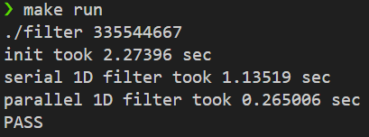

# HW1: 1D 필터 병렬화 (std::thread)

## 1. 문제 정의 (Problem Definition)

단일 스레드(Serial) 환경에서 1초 이상 소요되는 1D Convolution 필터 연산을 **C++ `std::thread`**를 활용하여 병렬화하고 유의미한 성능 향상을 달성합니다.

## 2. 문제 분석: 1D Convolution

제공된 시리얼 코드는 `k = {0.25, 0.5, 0.25}` 커널을 사용하는 1D Convolution 필터입니다.

`output[i] = (input[i] * 0.25) + (input[i+1] * 0.5) + (input[i+2] * 0.25)`

이 연산의 핵심 특징은 각 `output[i]`의 계산이 다른 `output[j]`의 계산과 **데이터 종속성이 없는(independent)** 완벽한 **데이터 병렬(Data-Parallel)** 문제라는 점입니다. 따라서 별도의 Lock이나 동기화 없이 전체 작업을 나누어 처리할 수 있습니다.

## 3. 병렬화 전략: 정적 분할 (Static Partitioning)

1.  **작업 분할:** 총 `N-2`개의 독립적인 계산 작업을 `NT`개(소스 코드상 `NT=32`로 설정됨)의 스레드에게 균등하게 분배합니다.
2.  **작업자 함수:** `filter_worker` 함수를 정의하여, 각 스레드가 자신에게 할당된 범위(`start_index` ~ `end_index`)의 `output` 값만 계산하도록 합니다.
3.  **스레드 관리:** `std::vector<std::thread>`를 사용하여 `NT`개의 스레드를 생성하고, 메인 스레드는 `join()`을 호출하여 모든 작업자 스레드가 완료될 때까지 대기합니다.

## 4. 결과

### 로컬 환경 테스트 (N=335544667, NT=32)

로컬 PC(WSL) 환경에서 데이터셋을 $N=335544667$로, 스레드 수를 $NT=32$로 설정하여 테스트를 진행했습니다.

시리얼 버전이 약 **1.135초** 소요된 반면, `std::thread`를 사용한 병렬 버전은 **0.265초**가 소요되어 약 **4.28배의 성능 향상(Speedup)**을 달성했습니다. `PASS`를 통해 병렬화 로직의 정확성 또한 검증했습니다.

## 5. 기술적 성과 (Technical Accomplishment)

* C++ `std::thread`를 사용한 기본적인 멀티스레딩 (스레드 생성, 인자 전달, `join` 대기) 방법을 적용했습니다.
* 데이터 병렬(Data-Parallel) 문제의 특성을 이해하고, **정적 작업 분할(Static Partitioning)** 전략을 성공적으로 구현했습니다.
* 스레드 간 동기화가 필요 없는(Lock-Free) 환경에서, `NT=32`로 설정된 병렬 코드가 시리얼 코드 대비 **유의미한 성능 향상(약 4.28배)**을 달성할 수 있음을 수치적으로 검증했습니다.