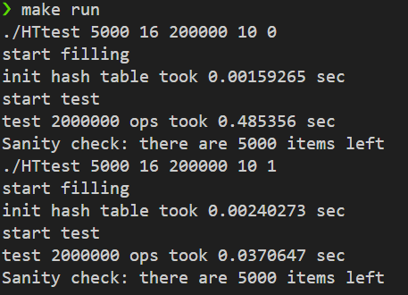

# HW2: 해시 테이블 동시성 제어 (Striped Locks)

## 1. 문제 정의 (Problem Definition)

여러 스레드가 동일한 해시 테이블에 동시에 접근(삽입, 삭제, 조회)할 때 발생하는 **경쟁 상태(Race Condition)**를 해결하는 것입니다.

이 프로젝트는 두 가지 락(Lock) 전략을 구현하고 그 성능을 비교합니다.
1.  **Base (Coarse-Grained Lock):** 테이블 전체에 **단 하나의 락**을 사용하는, 가장 단순하지만 병목 현상이 심각한 방식입니다.
2.  **Better (Fine-Grained Lock):** **여러 개의 락(Striped Locks)**을 사용하여 락이 필요한 범위를 최소화하고 병렬성을 극대화하는 방식입니다.

## 2. 구현 전략: 스트라이프 락 (Striped Locks)

`base` 버전(`locked_hash_table.h`)은 이미 구현된 전역 락(Global Lock)을 사용합니다.

`better` 버전(`better_locked_hash_table.h`)의 성능을 극대화하기 위해 **스트라이프 락**을 구현했습니다.

1.  **멤버 변수:** `TABLE_SIZE`(1000)개의 버킷과 별개로, `NUM_STRIPES`(128)개의 `std::mutex` 배열(`stripes`)을 선언합니다.
2.  **잠금 로직:**
    * `insert`, `remove`, `contains` 작업 시, `key` 값으로 `bucket_index` (0~999)를 계산합니다.
    * 해당 `bucket_index`를 `NUM_STRIPES`(128)로 다시 해시하여, 이 버킷을 담당할 `lock_index` (0~127)를 계산합니다.
    * **128개의 락 중 오직 `stripes[lock_index]` 하나만** `std::lock_guard`로 잠급니다.
3.  **이점:** 이 전략을 통해, 스레드 1이 3번 버킷(3번 락)을, 스레드 2가 5번 버킷(5번 락)을 접근할 때, 두 스레드는 **서로 다른 락**을 잡으므로 대기 없이 **동시에(Parallel)** 작업을 수행할 수 있습니다.

## 3. 결과

### 로컬 환경 테스트 (16 스레드, 20만 Ops)

로컬 PC(WSL, 16 스레드) 환경에서 `base` 버전과 `better` 버전의 성능을 비교했습니다.

`Sanity check`를 통해 두 버전 모두 `5000`개의 아이템이 남아있음을 확인, Race Condition 없이 **데이터 무결성을 보장**함을 검증했습니다.

* **Base (전체 락):** `0.485 sec`
* **Better (스트라이프 락):** `0.037 sec`

스트라이프 락을 적용한 `better` 버전이 `base` 버전 대비 약 **13.1배의 압도적인 성능 향상(Speedup)**을 달성했습니다.

## 4. 기술적 성과 (Technical Accomplishment)

* **락 경합(Lock Contention)의 이해:** 단일 락(`base`)이 멀티 스레드 환경에서 어떻게 심각한 병목(Bottleneck)이 되어 병렬성을 저해하는지(약 0.5초 소요) 확인했습니다.
* **Fine-Grained Lock 구현:** 락의 범위를 최소화하는 **'스트라이프 락(Striped Lock)'** 기법을 C++ `std::mutex`와 `std::lock_guard`를 사용해 성공적으로 구현했습니다.
* **성능 검증:** 16개 스레드 환경에서 13.1배의 성능 향상을 달성하며, Fine-Grained Lock이 어떻게 병렬성을 극대화하는지 수치적으로 검증했습니다.
* **데이터 무결성:** `Sanity check`를 통해 멀티 스레드 환경에서도 락이 데이터의 일관성을 올바르게 보장함을 확인했습니다.