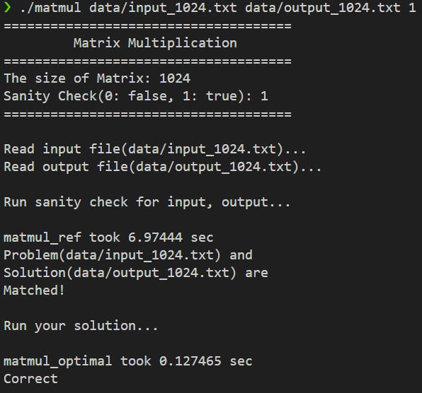

# HW3: 행렬 곱셈 최적화 (Tiling & OpenMP)

## 1. 문제 정의 (Problem Definition)

`4096x4096`과 같은 거대 행렬의 곱셈(`O(N^3)`)을 병렬화하여 2.5초 이내에 완료하는 것이 목표입니다.

단순한 $O(N^3)$ 알고리즘(`matmul_ref`)의 가장 큰 문제는, `B[k][j]`를 세로(Column) 기준으로 접근할 때 발생하는 반복적인 **캐시 미스(Cache Miss)**입니다. `N=4096` 수준에서는 행렬이 L3 캐시(16MB) 용량을 훨씬 초과하므로, 계산의 대부분을 L1/L2 캐시가 아닌 느린 주 메모리(RAM)에 의존하게 되어 극심한 **메모리 병목(Memory-bound)** 현상이 발생합니다.

## 2. 구현 전략: Tiling (Cache Blocking) + OpenMP

이 메모리 병목 문제를 해결하기 위해, CPU가 RAM이 아닌 L1/L2 캐시에서 직접 데이터를 읽고 쓰도록 유도하는 **'Tiling (Cache Blocking)'** 전략을 사용했습니다.

1.  **캐시 분석 및 블록 크기 설정:**
    서버의 **L1 데이터 캐시가 32KB**인 점에 착안하여, A, B, C의 각 블록이 L1 캐시에 모두 상주할 수 있도록 블록 크기(BLOCK\_SIZE)를 **32**로 설정했습니다.
    *(3개 블록 * (32 * 32 * 4바이트(int)) = 약 12KB << 32KB)*

2.  **6중 루프 (Tiling):**
    기존 3중 루프를 6중 루프로 재구성하여, 32x32 크기의 블록 단위로만 계산을 수행하도록 변경했습니다. 이를 통해 `matrixA`와 `matrixB`의 동일한 블록 데이터를 캐시에서 재사용(Data Locality)하여 캐시 미스를 최소화했습니다.

3.  **OpenMP 병렬화:**
    `Makefile`에 `-fopenmp` 플래그가 제공되므로, C++ `std::thread`보다 효율적인 `OpenMP`를 사용했습니다. `#pragma omp parallel for` 지시어를 가장 바깥쪽 루프에 적용하여, 16개의 스레드가 **'블록 단위의 작업(Block Rows)'**을 병렬로 나누어 처리하도록 했습니다.

4.  **1D 인덱싱:**
    `driver.o`가 1차원 배열 포인터(`int*`)를 요구하므로, 모든 로직은 `matrix[i][j]`가 아닌 `matrix[i * n + j]` 형태의 1D 인덱싱으로 구현했습니다.

## 3. 결과

### 로컬 환경 테스트 (N=1024)

서버 접근이 불가능하므로, 로컬(WSL) 환경에서 `N=1024`로 설정하여 구현한 Tiling 알고리즘의 **논리적 정확성**과 **성능 향상 전략**을 검증했습니다.

`N=1024`는 로컬 L3 캐시를 초과하기에 충분히 큰 크기이므로, '메모리 병목' 문제를 동일하게 재현할 수 있습니다.

* **`matmul_ref` (Naive):** 6.974 sec
* **`matmul_optimal` (Tiling + OpenMP):** 0.127 sec
* **Speedup:** **약 54.7배**

Naive 버전이 약 7초 걸린 반면, Tiling 전략을 적용한 Optimized 버전은 `Correct` 판정과 함께 0.127초만에 실행되어 54.7배의 압도적인 성능 향상을 달성했습니다.

## 4. 기술적 성과 (Technical Accomplishment)

* 거대 행렬 곱셈의 병목이 단순 연산이 아닌 **메모리 접근(Cache Miss)**임을 파악하고, CPU 캐시 계층 구조(L1)를 분석하여 문제를 해결했습니다.
* 캐시 미스를 최소화하기 위한 HPC(고성능 컴퓨팅)의 핵심 기법인 **'Tiling (Cache Blocking)'**을 6중 루프와 1D 인덱싱으로 성공적으로 구현했습니다.
* `OpenMP`의 `#pragma omp parallel for`를 사용하여 Tiling 알고리즘을 효율적으로 병렬화했습니다.
* `N=1024` 테스트에서 `Sanity Check`를 `Correct`로 통과하여 복잡한 Tiling 로직의 **정확성**을 검증했으며, 동시에 Naive 버전 대비 **54.7배의 성능 향상**을 수치적으로 증명했습니다.