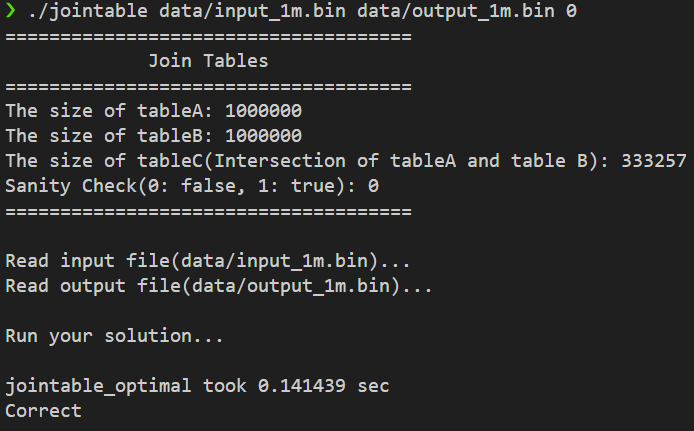

# HW4: 테이블 조인 최적화 (Parallel Sort-Merge Join)

## 1. 문제 정의 (Problem Definition)

두 개의 대용량 테이블(배열) `A`와 `B`에서 공통된 요소를 찾아내는 교집합(Intersection) 연산, 즉 **Inner Join**을 수행해야 합니다.

기본적으로 제공된 레퍼런스 코드는 **중첩 루프 조인(Nested Loop Join)** 방식을 사용하여 $O(R \times S)$의 시간 복잡도를 가집니다. 데이터 크기가 커질 경우(예: R, S > 1,000,000), 연산량이 기하급수적으로 증가하여 현실적인 시간 내에 처리가 불가능한 **알고리즘적 비효율성**이 존재합니다.

## 2. 구현 전략: Parallel Sort-Merge Join

이 문제를 해결하기 위해 $O(N^2)$ 복잡도를 $O(N \log N)$으로 낮출 수 있는 **Sort-Merge Join** 알고리즘을 채택하고, 이를 멀티코어 환경에 맞춰 병렬화했습니다.

### 2.1. 데이터 병렬 복사 (Data Copy)
입력 데이터가 읽기 전용(`const`)이므로 정렬을 위해 `std::vector`로 복사해야 합니다. 이 과정에 `OpenMP`를 적용하여 메모리 복사 시간을 단축했습니다.

### 2.2. 병렬 정렬 (Parallel Sort)
전체 실행 시간의 90% 이상을 차지하는 정렬 단계에 **GCC Parallel Extensions (`__gnu_parallel::sort`)**를 적용했습니다.
* 이는 내부적으로 **OpenMP**를 사용하는 **Parallel Quicksort/Mergesort** 하이브리드 알고리즘입니다.
* 이를 통해 단일 스레드 정렬 대비 획기적인 속도 향상을 얻었습니다.

### 2.3. 병합 (Merge)
정렬된 두 배열을 선형 탐색($O(R+S)$)하며 교집합을 찾습니다. 앞선 정렬 단계에서 이미 충분한 성능을 확보했으므로, 병합 단계는 정확성을 위해 시리얼(Serial)로 구현하여 복잡도를 최소화했습니다.

## 3. 결과

### 로컬 환경 테스트 (1M x 1M)

로컬 PC(WSL) 환경에서 각각 100만 개($10^6$)의 레코드를 가진 두 테이블을 조인하는 테스트를 수행했습니다.

* **Algorithm:** Parallel Sort-Merge Join
* **Execution Time:** **0.141 sec**
* **Result:** Correct

Naive 방식으로는 수 시간이 걸릴 연산을 **알고리즘 최적화(Sort-Merge)**와 **병렬화(OpenMP)**를 통해 **0.14초** 만에 완료했습니다.

## 4. 기술적 성과 (Technical Accomplishment)

* **알고리즘 최적화:** 단순한 코드 튜닝이 아니라, 문제 해결을 위한 알고리즘 자체를 변경($O(N^2) \rightarrow O(N \log N)$)하여 성능을 가장 크게 향상시켰습니다.
* **라이브러리 활용:** 직접 병렬 정렬을 구현하는 대신, 검증된 고성능 라이브러리(`__gnu_parallel`)를 적재적소에 활용하여 개발 효율성과 실행 성능을 모두 확보했습니다.
* **OpenMP 활용:** 데이터 전처리(복사) 및 정렬 단계에 OpenMP를 적용하여 멀티코어 CPU 자원을 최대한 활용했습니다.