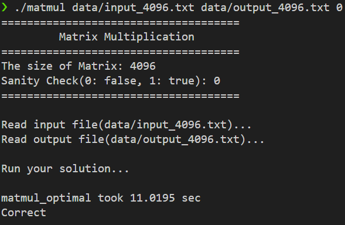
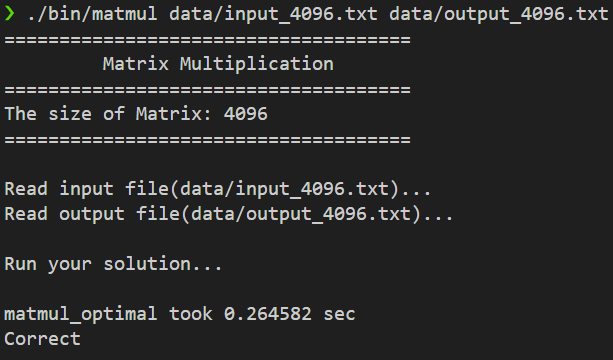

# HW5: GPU 행렬 곱셈 가속 (CUDA Shared Memory Tiling)

## 1. 문제 정의 (Problem Definition)

`4096x4096`과 같은 대규모 행렬 곱셈 연산은 CPU만으로는 처리에 한계가 있습니다. 이를 **GPU(CUDA)**의 병렬 처리 능력을 활용하여 극적으로 가속화하는 것이 목표입니다.

하지만 GPU는 연산 속도 대비 **Global Memory(VRAM) 접근 속도가 느리다**는 병목이 존재하므로, 단순 구현(Naive Kernel)으로는 GPU의 잠재력을 100% 끌어낼 수 없습니다.

## 2. 구현 전략: Shared Memory Tiling

GPU 메모리 병목을 해결하기 위해 **Shared Memory (On-chip Memory)**를 활용한 **Tiling** 기법을 적용했습니다.

1.  **Shared Memory Tiling:**
    * `32x32` 크기의 타일(Tile)을 설정하여, Global Memory의 데이터를 Shared Memory로 블록 단위로 적재(Load)합니다.
    * 스레드 블록 내 스레드들이 Shared Memory에 있는 데이터를 재사용함으로써 느린 Global Memory 접근을 획기적으로 줄입니다.

2.  **메모리 계층 최적화:**
    * `Global Memory` $\rightarrow$ `Shared Memory` $\rightarrow$ `Register`로 이어지는 메모리 계층 구조를 효율적으로 활용했습니다.
    * `__syncthreads()`를 사용하여 타일 로딩과 연산 사이의 동기화를 보장했습니다.

## 3. 결과

### 3.1. 정확성 검증 (N=1024)

로컬 PC(GTX 1660 Ti) 환경에서 `Correct` 판정을 통해 커널 로직의 무결성을 검증했습니다.
(참고: 작은 데이터셋에서는 CPU $\leftrightarrow$ GPU 데이터 전송 오버헤드(`cudaMemcpy`)가 커서 CPU 버전보다 총 소요 시간이 길게 측정됩니다.)

* **Time:** 0.271 sec (Result: Correct)

### 3.2. 대규모 성능 벤치마크 (N=4096) - CPU vs GPU

본 프로젝트의 핵심인 **대규모 데이터(Memory-bound)** 환경에서 **HW3(CPU Optimized)**와 **HW5(GPU Optimized)**의 성능을 비교했습니다.

| 구분 | 환경 | 실행 시간 (sec) | 비고 |
| :--- | :--- | :--- | :--- |
| **HW3 (CPU)** | Ryzen 7 4800H (OpenMP + Tiling) | `11.019 sec` | 16 Threads |
| **HW5 (GPU)** | GTX 1660 Ti (CUDA Shared Mem) | **`0.265 sec`** | **41.6배 가속** |

결과적으로 GPU 버전이 CPU 최적화 버전 대비 **약 41.6배의 압도적인 성능 향상(Speedup)**을 달성했습니다.

**[스크린샷 1: HW3 CPU 실행 결과 (11.02s)]**

**[스크린샷 2: HW5 GPU 실행 결과 (0.26s)]**

## 4. 기술적 성과 (Technical Accomplishment)

* **CUDA 아키텍처 활용:** Global Memory의 대역폭 한계를 극복하기 위해 **Shared Memory Tiling**을 구현하여 GPU 가속 성능을 극대화했습니다.
* **오버헤드와 가속의 관계 이해:** 작은 데이터(`N=1024`)에서는 전송 오버헤드가, 큰 데이터(`N=4096`)에서는 병렬 연산 능력이 성능을 지배함을 실험적으로 확인했습니다.
* **41배 성능 향상:** 동일한 알고리즘(Tiling)이라도 하드웨어 특성(CPU vs GPU)에 맞춰 최적화했을 때, 대규모 연산에서 GPU가 얼마나 강력한지 수치적으로 증명했습니다.