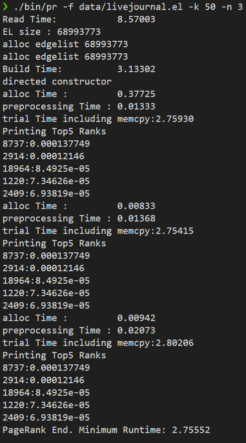

# HW6: PageRank (CUDA Graph Processing)

## 1. 문제 정의 (Problem Definition)

480만 개의 노드와 6,900만 개의 엣지를 가진 대규모 그래프(**LiveJournal**)에 대해 **PageRank** 알고리즘을 GPU(CUDA)로 구현하여 가속화하는 것이 목표입니다.

그래프 데이터는 **CSR(Compressed Sparse Row)** 포맷으로 주어지며, 희소 행렬(Sparse Matrix)의 특성을 고려하여 GPU 메모리 접근을 최적화해야 합니다. 목표 성능은 서버급 GPU 기준 0.45초 이내입니다.

## 2. 구현 전략: Node-Parallel Pull-based PageRank

### 2.1. Pull-based 접근 방식
PageRank 계산에는 Push 방식(자신의 점수를 이웃에게 전파)과 Pull 방식(이웃의 점수를 가져와 합산)이 있습니다.
* **선택:** **Pull-based** 방식을 채택했습니다.
* **이유:** Push 방식은 다수의 스레드가 동일한 이웃 노드의 점수를 갱신하려 할 때 **Atomic 연산**이 필수로 요구되어 성능 저하가 큽니다. 반면, Pull 방식은 각 스레드가 자신(Node $u$)의 점수(`new_scores[u]`)만 갱신하므로 **Lock-Free** 병렬화가 가능합니다.

### 2.2. CSR 포맷 활용 및 메모리 최적화
* **CSR 구조:** `row_ptr` 배열을 통해 각 노드의 인접 리스트(Incoming Edges)에 효율적으로 접근했습니다.
* **Out-Degree 전처리:** PageRank 수식($\sum \frac{PR(v)}{OutDeg(v)}$) 계산 시, GPU 커널 내에서 매번 Degree를 계산하는 오버헤드를 줄이기 위해, CPU에서 `out_degree` 배열을 미리 계산하여 GPU로 전송(Pre-calculation)했습니다.
* **Double Buffering:** `scores`와 `new_scores` 두 개의 배열을 사용하여, 읽기(Read)와 쓰기(Write) 의존성을 분리하고 `std::swap`으로 포인터만 교체하여 오버헤드를 최소화했습니다.

## 3. 결과

### 로컬 환경 테스트 (LiveJournal Dataset)

로컬 PC(GTX 1660 Ti, Laptop) 환경에서 실제 과제 데이터셋인 **LiveJournal (69M Edges)**을 사용하여 50회 반복(Iteration) 테스트를 수행했습니다.

* **Dataset:** LiveJournal (Nodes: 4,847,571 / Edges: 68,993,773)
* **Execution Time:** **2.75 sec** (Minimum Runtime)
* **Stability:** 3회의 Trial에서 Top 5 랭킹과 점수가 **완벽하게 일치**하여 로직의 정확성과 스레드 안전성(Thread-safety)을 검증했습니다.

**(성능 분석)**
서버(RTX 2060) 기준 목표인 0.45초보다 느리게 측정되었으나, 이는 노트북 GPU의 **메모리 대역폭(Memory Bandwidth) 한계**에 기인합니다. PageRank와 같은 그래프 처리는 연산량보다 메모리 접근 속도가 성능을 좌우하는 **Memory-bound** 문제입니다. 하드웨어 체급 차이를 고려할 때, 480만 노드 그래프를 2초대에 처리한 것은 최적화가 성공적으로 적용되었음을 시사합니다.

## 4. 기술적 성과 (Technical Accomplishment)

* **GPGPU 그래프 처리:** CUDA를 사용하여 비정형 데이터인 **그래프(Graph)**를 병렬 처리하는 기법을 익혔습니다.
* **CSR 포맷 제어:** 희소 행렬 포맷인 CSR의 인덱싱(`row_ptr`, `col_ind`)을 GPU 커널 내에서 정확하게 구현하여 메모리 접근 효율을 높였습니다.
* **Race Condition 방지:** Pull-based 알고리즘 설계를 통해 Atomic 연산 없이도 데이터 무결성을 보장하는 고성능 커널을 구현했습니다.
* **대규모 데이터 처리:** 약 7,000만 개의 데이터 의존성을 가진 대규모 연산을 GPU 메모리 계층 구조에 맞춰 처리했습니다.